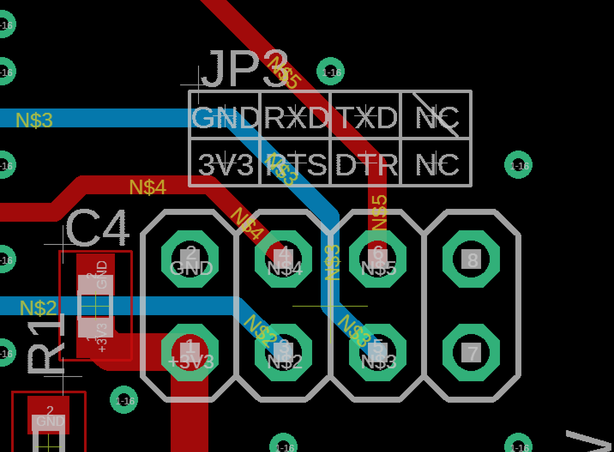
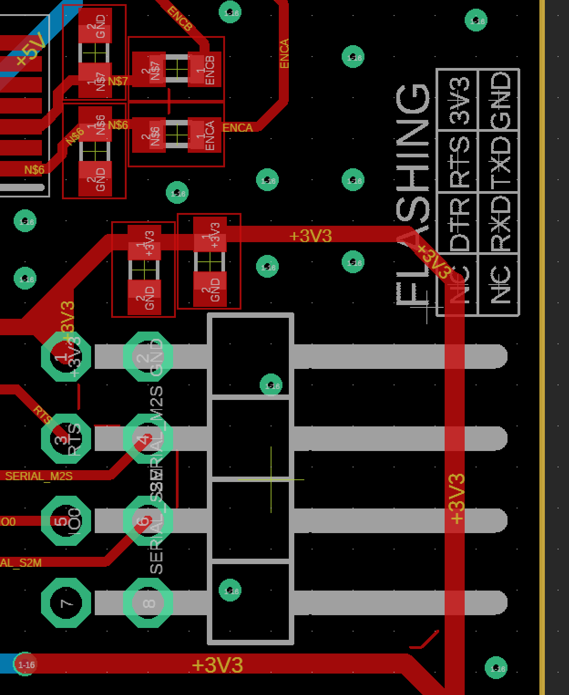

# Avi_ESP_Hardware_Utility

# ESP_Writer_BRD_v1.0.0

https://akizukidenshi.com/catalog/g/gK-01977/

秋月電子のFT232RL USBシリアル変換基板を用いてESPを書き込むことができる基板

FT232RLの3.3vレギュレータとは別のレギュレータをもち，USB電源から3.3v電源を生成する．この電源を用いてマイコンを駆動する場合は基板のスイッチをオンにする．他電源から基板に電力を供給する場合はスイッチをオフにする

# teraterm_macro
teratermにて，ESP_Writer_BRD_v1.0.0 を用いて基板とシリアル通信する場合，このマクロファイルの実行が必要である．

# pio_serial_monitor
teratermにて，ESP_Writer_BRD_v1.0.0 を用いて基板とシリアル通信する場合，platformio.iniの一例を示す．

# 配線

書き込み基板側は，TXDの横のNCピンを潰し，刺し間違えないようにする．

対象基板側はDTRの横のNCピンを潰し，刺し間違えないようにする．

基板側のピンだけでなく，配線コネクタについても溶かして潰すとより良い．

配線は，RXDとTXDを接続，他は同じ物同士を接続する．